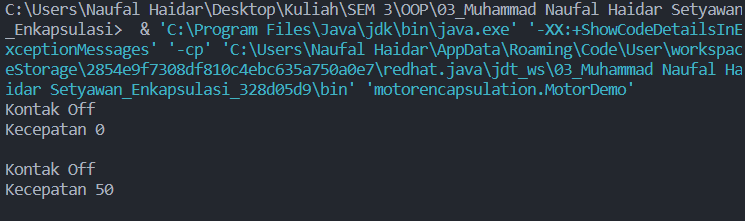
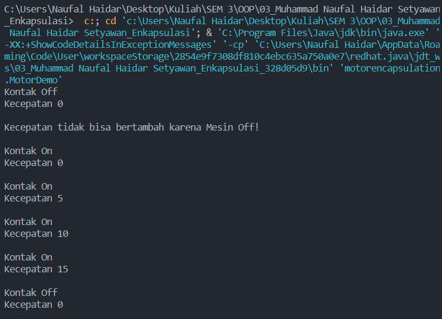

# Praktikum 3 - Enkapsulasi

Nama : Muhammad Naufal Haidar Setyawan <br>
NIM : 2241720097 <br>
Kelas : 2C <br>
Absen : 18 <br>

## Percobaan 1

Code :

- Class Motor

```
package motorencapsulation;

public class Motor {
    public int kecepatan = 0;
    public boolean kontakOn = false;

    public void printStatus() {
        if (kontakOn == true) {
            System.out.println("Kontak On");
        } else {
            System.out.println("Kontak Off");
        }
        System.out.println("Kecepatan " + kecepatan + "\n");
    }
}
```

- Class Motor Demo :

```
package motorencapsulation;

public class MotorDemo {
    public static void main(String[] args) {
        Motor motor = new Motor();
        motor.printStatus();
        motor.kecepatan = 50;
        motor.printStatus();
    }
}
```

Output :


## Percobaan 2

Code :

- Class Motor

```
package motorencapsulation;

package motorencapsulation;

public class Motor {
    private int kecepatan = 0;
    private boolean kontakOn = false;

    public void nyalakanMesin() {
        kontakOn = true;
    }

    public void matikanMesin() {
        kontakOn = false;
        kecepatan = 0;
    }

    public void tambahKecepatan() {
        if (kontakOn == true) {
            kecepatan += 5;
        } else {
            System.out.println("Kecepatan tidak bisa bertambah karena Mesin Off! \n");
        }
    }

    public void kurangiKecepatan() {
        if (kontakOn == true) {
            kecepatan -= 5;
        } else {
            System.out.println("Kecepatan tidak bisa bertambah karena Mesin Off! \n");
        }
    }

    public void printStatus() {
        if (kontakOn == true) {
            System.out.println("Kontak On");
        } else {
            System.out.println("Kontak Off");
        }
        System.out.println("Kecepatan " + kecepatan + "\n");
    }
}
```

- Class Motor Demo :

```
package motorencapsulation;

public class MotorDemo {
    public static void main(String[] args) {
        Motor motor = new Motor();
        motor.printStatus();
        motor.tambahKecepatan();

        motor.nyalakanMesin();
        motor.printStatus();

        motor.tambahKecepatan();
        motor.printStatus();

        motor.tambahKecepatan();
        motor.printStatus();

        motor.tambahKecepatan();
        motor.printStatus();

        motor.matikanMesin();
        motor.printStatus();

    }
}
```

Output :


### Pertanyaan

- Pada class TestMobil, saat kita menambah kecepatan untuk pertama kalinya, mengapa
  muncul peringatan “Kecepatan tidak bisa bertambah karena Mesin Off!”?
- Mengapa atribut kecepatan dan kontakOn diset private?
- Ubah class Motor sehingga kecepatan maksimalnya adalah 100!
